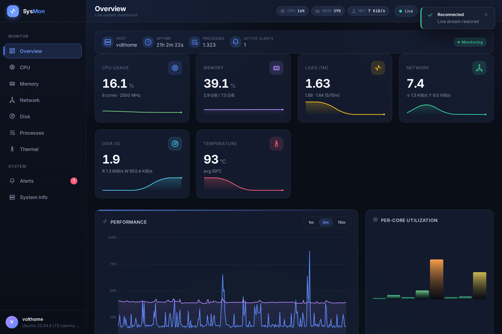

# SysMon

A modern, real-time system & server monitoring dashboard for Linux, written in **pure Rust** with a **zero-dependency** embedded web UI. The entire frontend is compiled into a single self-contained binary (~2.7 MB) — no Node, no runtime, no external assets.



## Features

- **Live metrics over WebSocket** — CPU (per-core), memory & swap, load average, network per-interface, disk I/O & filesystems, thermal/battery, host info, and a full process table.
- **Modern SPA UI** — dark/light themes, accent colors, canvas charts (line, gauge, bars, sparkline, heatmap), sortable/searchable tables, responsive down to mobile.
- **Rich contextual tooltips** — hover the CPU chart to see temperature & load at that instant; hover the memory chart to see the top memory-consuming processes.
- **Alert engine** — threshold rules with duration debounce, an event log, and click-to-expand rule detail (current value vs. threshold, severity, sustained-for).
- **Efficient by design** — `/proc`-based collectors, delta sampling, `parking_lot` locks, a `tokio` broadcast channel, and LTO/stripped release builds.

## Quick start

```bash
# build (offline-friendly; deps are vendored in the cargo cache)
CARGO_NET_OFFLINE=true cargo build --release --offline

# run (binds 0.0.0.0 so it's reachable on your LAN)
./target/release/sysmon --port 8099
```

Then open `http://localhost:8099` (or `http://<lan-ip>:8099` from another device).

## Architecture

```
src/
  collectors/   CPU, memory, load, network, disk, thermal, process, host  (/proc readers)
  state/        metric structs (serde camelCase), config, shared AppState
  alerts/       threshold engine with duration debounce
  web/          axum router: REST (/api/*) + WebSocket (/ws) + embedded assets
  sampler.rs    fast / process / thermal / host tokio sampling tasks
assets/
  css/          theme, layout, components, charts, responsive
  js/           store, ws (auto-reconnect), router, charts/*, components/*, views/*
tools/          headless-Chrome CDP validators (used to prove 0 console errors)
```

The frontend is embedded at compile time via `include_bytes!` (`src/web/assets.rs`), so the release binary is fully self-contained.

## REST endpoints

| Endpoint          | Description                        |
| ----------------- | ---------------------------------- |
| `GET /api/snapshot` | Current metrics snapshot         |
| `GET /api/host`     | Static host info                 |
| `GET /api/config`   | Effective config incl. alert rules |
| `GET /ws`           | WebSocket stream (bootstrap + live updates) |

## Configuration

Ports and sampling intervals can be set via CLI flags and environment overrides (see `src/state/config.rs`). Default alert rules cover high CPU, memory, swap, disk, load, and temperature.

## Validation

UI correctness is checked automatically with a zero-dependency Chrome DevTools Protocol harness (`tools/cdp-audit.mjs`) that loads all 9 views across 4 viewports and exercises interactions (sort, search, theme toggle, chart hover). The suite reports **0 console errors / 0 layout overflow**.

```bash
# with a headless Chrome listening on --remote-debugging-port=9222
CDP_PORT=9222 APP_URL=http://localhost:8099 node tools/cdp-audit.mjs
```

## License

MIT
